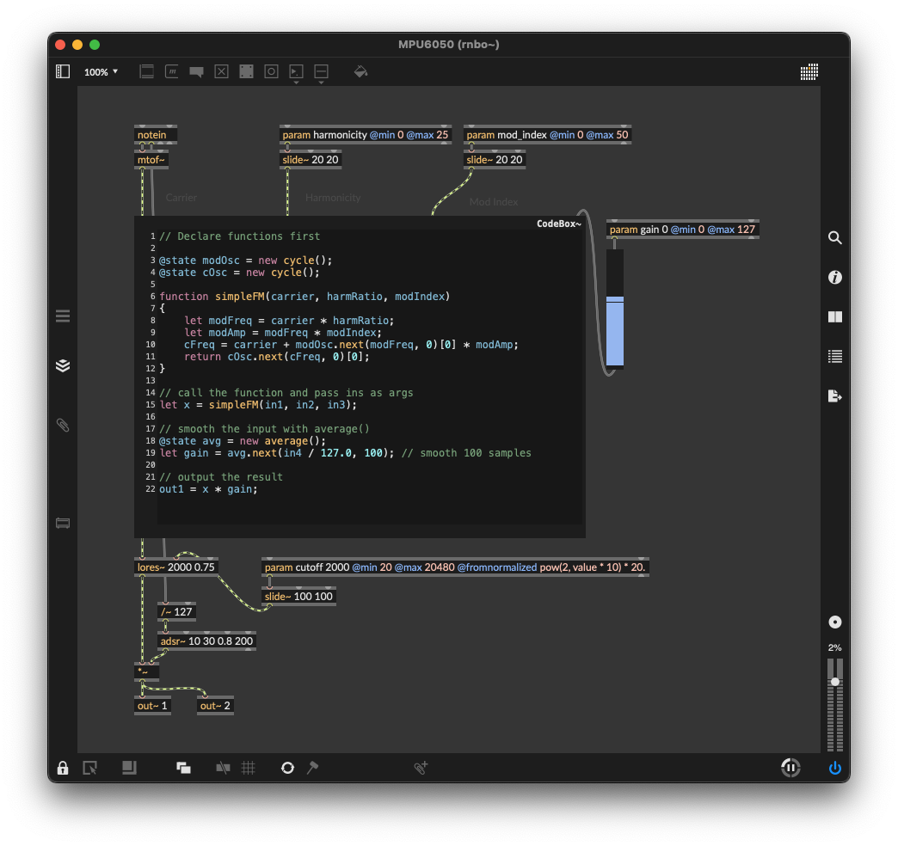
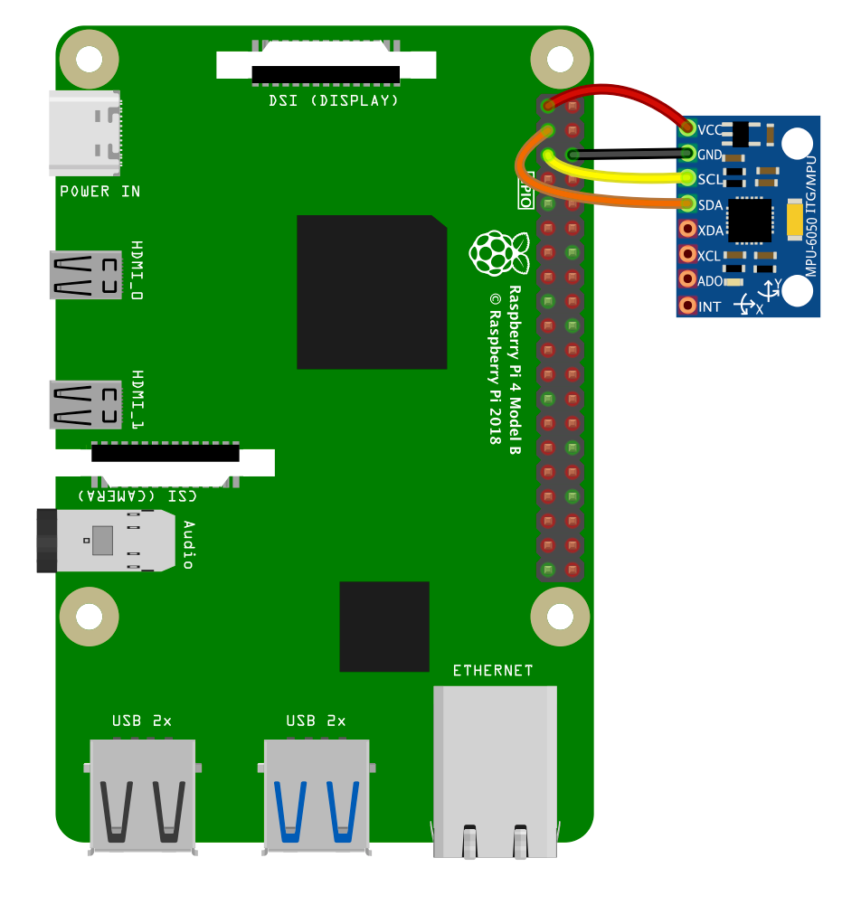
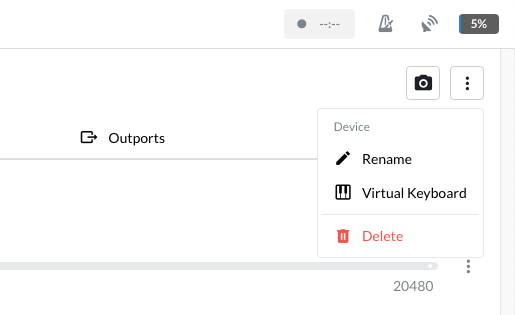
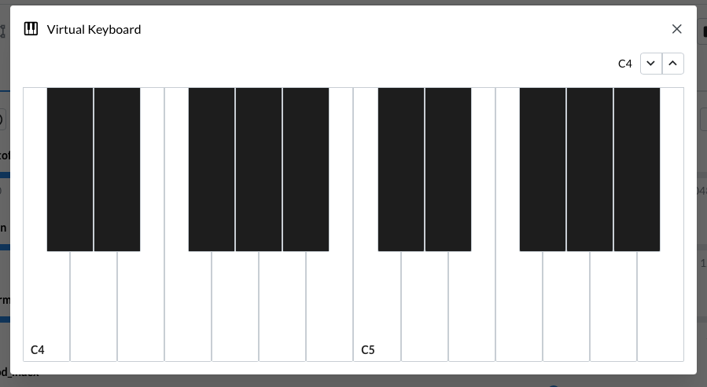

# RNBO-RPi-IMU

An Inertial Measurement Unit (IMU) is a common module to use with microcontrollers for measuring tilt and rotation. They're small and are perfect for use in wearable technology and robotics projects. In this article we'll use an MPU6050 with the i2c protocol and get it talking to some parameters in our RNBO patcher on the Raspberry Pi.

> ⚙️ Before attempting this tutorial, make sure you're already familiar with the basics of exporting your RNBO patchers to the RPi and that your audio interface is working correctly with it.

## Things you'll need:

* An MPU6050 module
* Hook up wires

We'll start by exporting the following patcher to the Raspberry Pi target:


> Download [SimpleFM_Mod.maxpat](./SimpleFM_Mod.maxpat)

`ssh` in, or connect up a keyboard and monitor. We'll utilize a python module that performs all the communication and processing called `mpu6050-raspberrypi` and another for communicating with the runner via OSC. You can use any OSC library you like, this example will use `python-osc`.

Lets first create a working directory a python virtual environment by running these commands from your pi:

```bash
mkdir RNBO-IMU
cd RNBO-IMU
python -m venv .venv
```

Then let's install system dependencies:

```bash
sudo apt install -y i2c-tools libi2c-dev build-essential
```

Now we'll enter the python venv and install some python dependencies:

```bash
source .venv/bin/activate
pip install --upgrade pip smbus-cffi mpu6050-raspberrypi python-osc
```

Now we'll need to enable i2c on the RPi. `sudo raspi-config` will bring up the config menu. Select "Interfacing Options" and then "i2c". Enable it, then when prompted select "No" for rebooting your RPi. We're going to power off the RPi and connect up our module. Exit the config menu without rebooting then at the terminal:

```bash
sudo poweroff
```

It's a good idea to only make connections to the RPi when powered off. Wait about 10 seconds then remove the power cable.

## Connecting the module

Now connect up the MPU6050 like so:

`3.3v` (red) from the RPi connects to the `VCC` on the module
`GND` (black)  from the RPi connects to the `GND` on the module
`SCL` (yellow) from the RPi to the `SCL` on the module
`SDA` (orange) from the RPi to the `SDA` on the module



With this all connected up, power on the RPi. Once it's booted, we can check if the module is connected and available using this terminal command:

```bash
i2cdetect -y 1
```

You should see the following, which shows the module's address in hexadecimal (0x68).

```
     0  1  2  3  4  5  6  7  8  9  a  b  c  d  e  f
00:          -- -- -- -- -- -- -- -- -- -- -- -- --
10: -- -- -- -- -- -- -- -- -- -- -- -- -- -- -- --
20: -- -- -- -- -- -- -- -- -- -- -- -- -- -- -- --
30: -- -- -- -- -- -- -- -- -- -- -- -- -- -- -- --
40: -- -- -- -- -- -- -- -- -- -- -- -- -- -- -- --
50: -- -- -- -- -- -- -- -- -- -- -- -- -- -- -- --
60: -- -- -- -- -- -- -- -- 68 -- -- -- -- -- -- --
70: -- -- -- -- -- -- -- --
```

If your module isn't showing up, you can use these two commands to disable then reenable the I2C driver without rebooting:

```bash
sudo rmmod i2c_dev
sudo modprobe i2c_dev
```

Let's create a python script to run that will communicate with the RNBO runner and the module.

```bash
nano RNBO-RPi-MPU6050.py
```

In this example script we're only using values from the Accelerometer data to read the tilt angle of the module and assign them to the parameters. We're dividing the absolute value of each reading by `9.80665` (the approximate, average acceleration of *gravity* in metres per second, squared) to get a normalized value between 0 ... 1 to use with each parameter. This means the parameter will be at the minimum value when the sensor is placed flat - and move to the end of the parameter range when the  sensor is tilted in either direction.

Instead of `abs()` you could divide the sensor value by `9.80665`, add `1` then divide by `2` to map the entire tilt range to the parameter range, if you want to control the sound by tilting the module all the way around.

## Running the script

To run the python script, ensure you're in the directory and python venv we created before:

```bash
cd ~/RNBO-IMU
source .venv/bin/activate
python RNBO-RPi-MPU6050.py
```

You should see the sensor values on the screen. The patcher needs a MIDI note to trigger a sound, you can use the Raspberry Pi Web Interface to trigger a MIDI note from your browser if you don't have a MIDI controller connected. Don't forget to adjust the gain in the parameter menu first!




